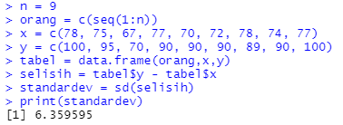
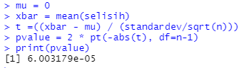
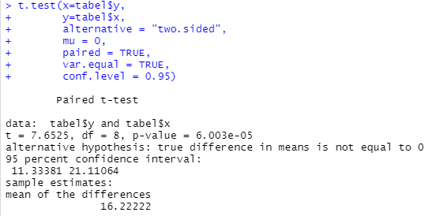
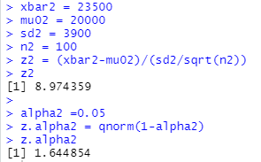
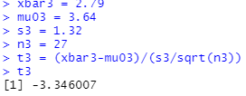
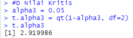
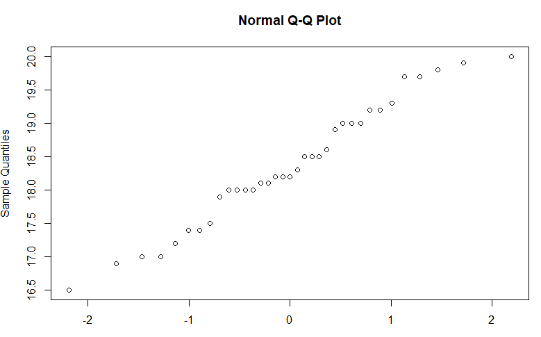
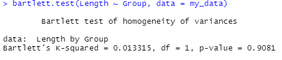
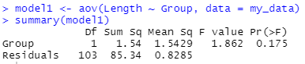
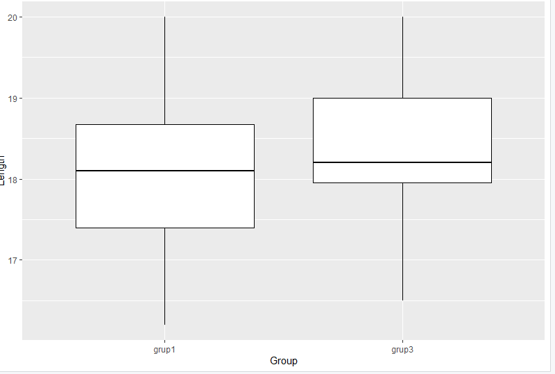

# P2_Probstat_B_5025201062
<h1>1</h1>
<h2>a. Carilah Standar Deviasi dari data selisih pasangan pengamatan tabel diatas</h2><br>

```c
n = 9
orang = c(seq(1:n))
x = c(78, 75, 67, 77, 70, 72, 78, 74, 77)
y = c(100, 95, 70, 90, 90, 90, 89, 90, 100)
tabel = data.frame(orang,x,y)
selisih = tabel$y - tabel$x
standardev = sd(selisih)
print(standardev)
```



<h2>b. carilah nilai t (p-value)</h2>

```c
mu = 0
xbar = mean(selisih)
t =((xbar - mu) / (standardev/sqrt(n)))
pvalue = 2 * pt(-abs(t), df=n-1)
print(pvalue)
```



<h2>c. pengaruh kadar oksigen sebelum dan sesudah aktivitas A</h2>

```c
t.test(x=tabel$y, 
       y=tabel$x,
       alternative = "two.sided", 
       mu = 0, 
       paired = TRUE, 
       var.equal = TRUE, 
       conf.level = 0.95)
```



<h1>2</h1>



<h2>a.</h2>
Setuju, karena setelah diuji menghasilkan tertolak H0 (z>Z.alpha) sehingga rata-rata mobil dikemudikan per tahun lebih dari 20.000km

<h2>b.</h2>
Sesuai dengan yang telah ditulis diatas nilai 8,974359 adalah nilai dari zhitung(z2) melebihi nilai ztabel(z.alpha2) maka keputusan yang diambil adalah Tolak H0 <br>sehingga disimpulkan bahwa rata-rata mobil dikemudikan pertahun lebih dari 20.000km

<h2>c.</h2>
Dikarenakan nilai pvalue < alpha(0,05) maka keputusan yang diambil adalah Tolak H0<br>
sehingga disimpulkan bahwa rata-rata mobil dikemudikan pertahun lebih dari 20.000km

<h1>3</h1>
<h2>a.</h2>
H0 : mu = mu0","\n","mu !=(tidak sama dengan) mu0
<h2>c.</h2>



<h2>d.</h2>



<h2>e.</h2>
Keputusan : Gagal Tolak H0
<h2>f.</h2>
Kesimpulan : Tidak ada perbedaan pada rata-rata jumlah saham perusahaan di dua kota tersebut<br>

<h1>4</h1>
<h2>a.</h2>



Berdasarkan plot kuantil normal di atas, tidak ditemukan outlier utama pada homogenitas varians<br>
<h2>b.</h2>



<h2>c.</h2>



<h2>d.</h2>
Nilai P adalah 0.0013, kurang dari 0.005 sehingga H0 ditolak<br>
<h2>f.</h2>

<br>

<h1>5</h1>
